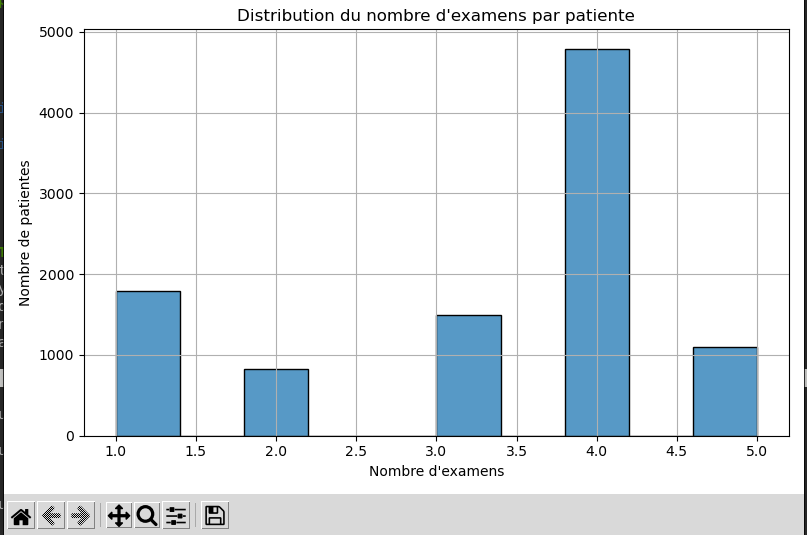
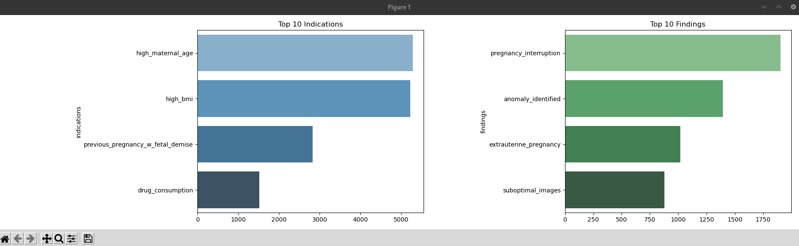
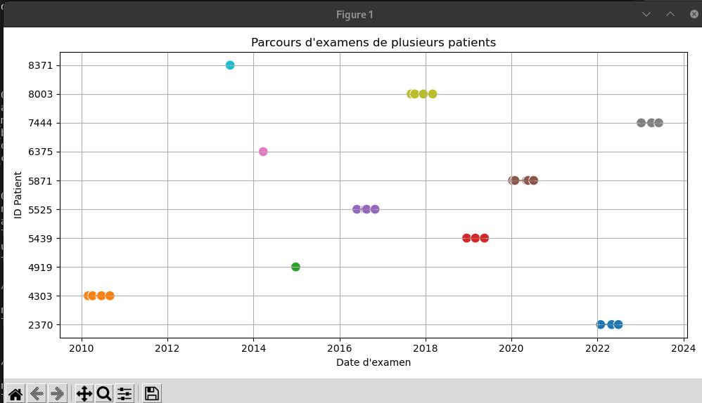

# part 2

	
## Bibliothèques à installer :

`pip install pandas matplotlib seaborn wordcloud`

## notion

##Task1
Patients	10 000
Moyenne		3.26 examens
Médiane		4 examens
Min / Max	1 à 5 examens
Écart-type	1.29

##Task2

Top 10 Indications:
indications
high_maternal_age                    5290
high_bmi                             5228
previous_pregnancy_w_fetal_demise    2833
drug_consumption                     1517
Name: count, dtype: int64

Top 10 Findings:
findings
pregnancy_interruption    1902
anomaly_identified        1394
extrauterine_pregnancy    1020
suboptimal_images          877

## links

